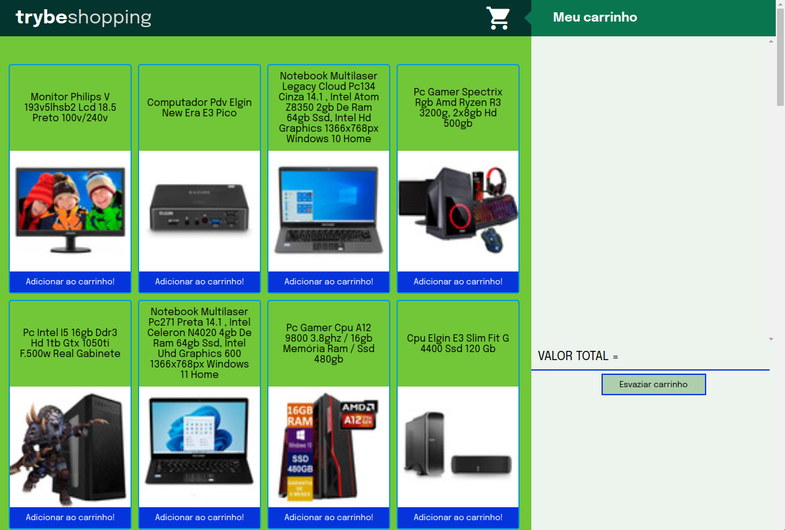

🛒 Shopping-Cart



## Acesse o projeto clicando <a href="https://eliedson1979.github.io/shoppingcart/">AQUI</a>

<br />

## 📡 Desenvolvimento

Projeto desenvolvido na <a href="https://betrybe.com/" target="_blank">Trybe</a> durante o módulo de Front-End!

Nesse projeto desenvolvi uma aplicação de carrinho de compras, onde foi práticado o desenvolvimento orientado a testes, o famoso TDD (Test Driven Development).

<br />

## 🚀 Instalação e execução

  <details>
    <summary>Instalando e executando</summary>
    <br />

### 1 - Clone o repositório:

```
git clone git@github.com:Eliedson1979/shoppingcart.git
```

### 2 - Apos ter o repositório clonado em sua maquina, execute este comando para acessar a pasta do projeto:

```sh
cd shoppingcart
```

### 3 - Dentro da pasta do projeto, execute o index:

```
Acesse o Index.html

```
### 5 - Acesse a aplicação:

Abrindo na porta padrão que o React usa: <http://localhost:3000/> em seu navegador.

  </details>
<br />

## ⚙️ Tecnologias

* HTML5
* CSS3
* JavaScript
* TDD
